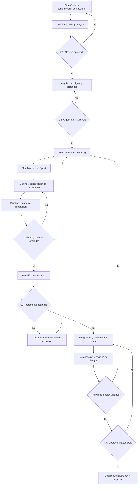

# Diagrama 1. Ciclo de vida híbrido incremental

```mermaid
flowchart TD
    A[Diagnóstico y comunicación con usuarios] --> B[Definir RF, RNF y riesgos]
    B --> C{G1: Alcance aprobado}
    C -- No --> A
    C -- Sí --> D[Arquitectura ligera y prototipos]
    D --> E{G2: Arquitectura validada}
    E -- No --> D
    E -- Sí --> F[Priorizar Product Backlog]
    F --> G[Planificación del Sprint]
    G --> H[Diseño y construcción del incremento]
    H --> I[Pruebas unitarias e integración]
    I --> J{Calidad y criterios cumplidos}
    J -- No --> H
    J -- Sí --> K[Revisión con usuarios]
    K --> L{G3: Incremento aceptado}
    L -- No --> M[Registrar observaciones y repriorizar]
    M --> F
    L -- Sí --> N[Integración y ambiente de prueba]
    N --> O[Retrospectiva y revisión de riesgos]
    O --> P{¿Hay más funcionalidades?}
    P -- Sí --> F
    P -- No --> Q{G4: Liberación autorizada}
    Q -- No --> N
    Q -- Sí --> R[Despliegue autorizado y soporte]
```

Las puertas G1-G4 son controles propuestos para el proyecto. Las iteraciones se repiten hasta completar el alcance aprobado.
