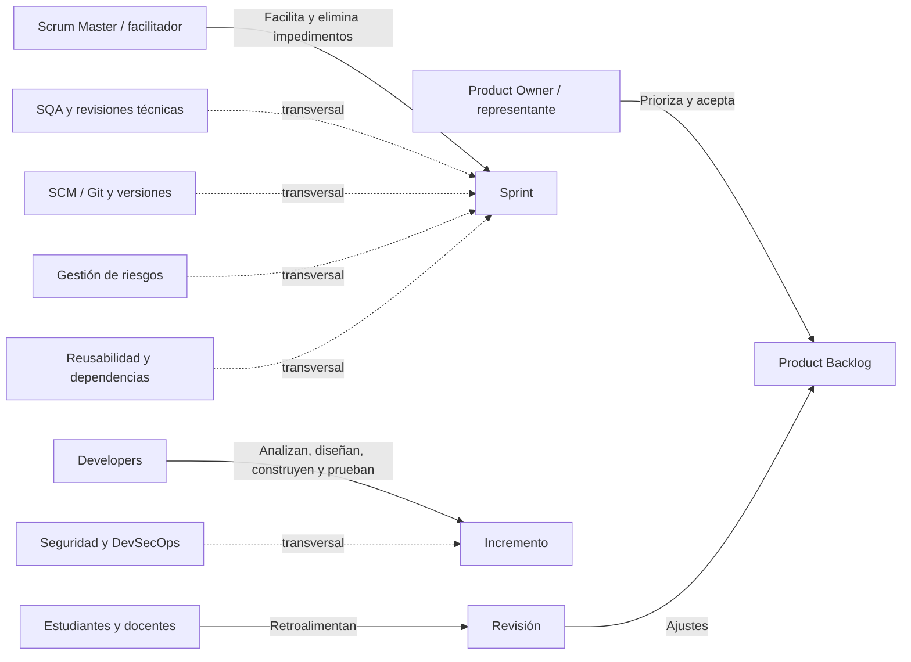

# Diagrama 2. Roles y actividades sombrilla

```mermaid
flowchart LR
    PO[Product Owner / representante] -->|Prioriza y acepta| PB[Product Backlog]
    SM[Scrum Master / facilitador] -->|Facilita y elimina impedimentos| SP[Sprint]
    DEV[Developers] -->|Analizan, diseñan, construyen y prueban| INC[Incremento]
    USR[Estudiantes y docentes] -->|Retroalimentan| REV[Revisión]
    REV -->|Ajustes| PB

    QA[SQA y revisiones técnicas] -. transversal .-> SP
    SCM[SCM / Git y versiones] -. transversal .-> SP
    RISK[Gestión de riesgos] -. transversal .-> SP
    REUSE[Reusabilidad y dependencias] -. transversal .-> SP
    SEC[Seguridad y DevSecOps] -. transversal .-> INC
```
